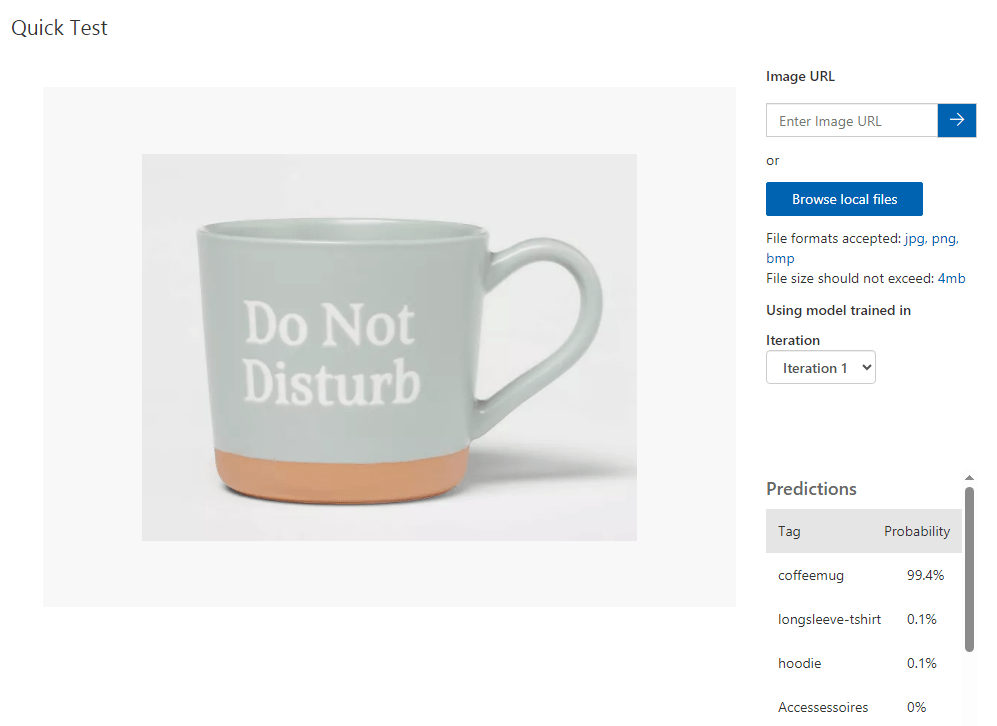

# Challenge 3 - Search Based on Images

### Estimated Duration: 90 Minutes

## Background Story

Now that you have a database to find potential issues faced by Woodgrove Retail, the next step is to build an AI service and add additional functionalities. The goal of the feature should be to allow 'search and find' of products available. It can be done by uploading a picture found by a potential customer to see if the same item is available.

## Technical Details

Using Vision Studio and Azure Machine Learning, you will be tagging a few dozen images and will be building a service to repurpose the images on the website potentially.  

Here are the [images](https://openhackguides.blob.core.windows.net/ai-openhack/images.zip) to start with.

Your task:

* Set up Azure Custom Vision service
* Visit the Custom Vision web page
* Upload each folder and tag the images with the folder name
* Train

## Success Criteria

* Successfully test against the supplied images in the Test folder

## Resources

- [Quickstart: Build an image classification model with the Custom Vision portal](https://learn.microsoft.com/en-us/azure/ai-services/custom-vision-service/getting-started-build-a-classifier?source=recommendations)
- [Create Custom Vision](https://portal.azure.com/?microsoft_azure_marketplace_ItemHideKey=microsoft_azure_cognitiveservices_customvision#create/Microsoft.CognitiveServicesCustomVision)
- [Custom Vision web page](https://customvision.ai/)

## Conclusion

Completing this challenge will enable you to integrate computer vision capabilities into applications using Azure Vision Studio and Machine Learning. You will also learn how to develop AI-powered image search features and enhance user experience by allowing customers to search products based on images they upload.
