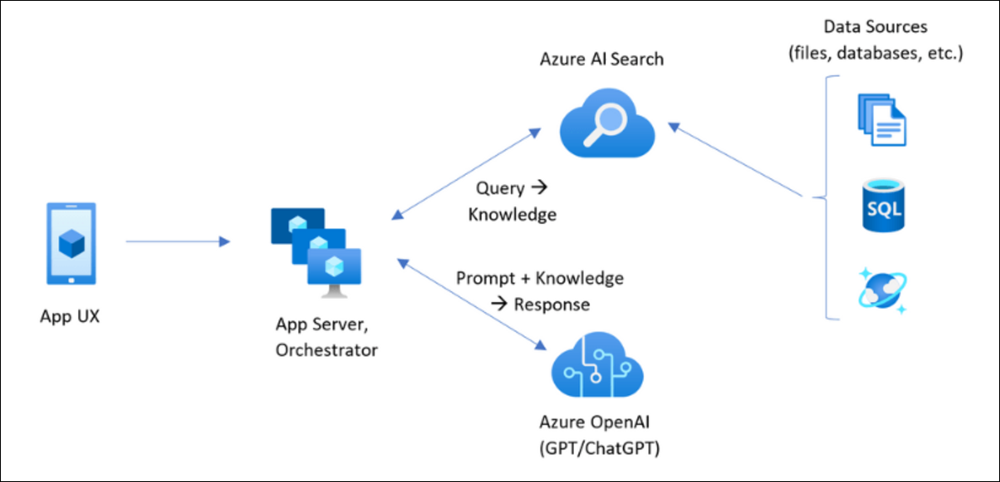

# Challenge 4 - RAG Pattern

### Estimated Duration: 90 Minutes

## Background Story
To enhance the results of the products available to customers, Woodgrove Retail wants to utilize Azure OpenAI. This challenge will utilize the [RAG pattern](https://learn.microsoft.com/en-us/azure/search/retrieval-augmented-generation-overview) as part of the solution. 

## Technical Details

The team needs to utilize the Jupyter Notebook, which will take the existing SQL table, provided view, and images to generate PDF files that will be uploaded to Azure Blob Storage. Then, using cognitive skills, extract enhanced data from the documents to include at least the following:
* Article Number
* Category
* Content
* Color
* The Related Image 

### Generate product documentation:

* Convert SQL data to PDFs
* Include images and metadata
* Implement cognitive search:
* Extract key attributes
* Build search index
* Enable semantic search

### Required Fields:

* Article Number
* Category
* Content
* Color
* Product Image
* Location Data

### Steps Required

1. Generate PDF files from the data provided.
1. Download the [sample Jupyter Notebook](https://openhackguides.blob.core.windows.net/ai-openhack/generate-markdown.ipynb) to generate the files needed.
1. Here is a [requirements.txt file](https://openhackguides.blob.core.windows.net/ai-openhack/requirements.txt) as well.
1. Here is a sample of the [markdown output.](https://openhackguides.blob.core.windows.net/ai-openhack/780012.0.md)
1. Here is a sample of the [generated PDF.](https://openhackguides.blob.core.windows.net/ai-openhack/780012.0.pdf)

## Success Criteria

Demonstrate to the coach a working search experience using the generated documents that use cognitive skills to provide a better search experience to find out what categories were provided to which locations.

* Working Azure AI search
* Successful attribute extraction
* Accurate search results
* Demo of enhanced search experience

<validation step="3599a217-7e0b-467e-821a-ef74c11f8dfc" />

## Resources

- https://learn.microsoft.com/en-us/azure/ai-studio/concepts/retrieval-augmented-generation
- https://learn.microsoft.com/en-us/azure/ai-studio/how-to/data-add
- https://learn.microsoft.com/en-us/azure/ai-studio/how-to/index-add
- [How to add and manage data in your Azure AI Studio project](https://learn.microsoft.com/en-us/azure/ai-studio/how-to/data-add)
- [How to build and consume vector indexes in Azure AI Studio](https://learn.microsoft.com/en-us/azure/ai-studio/how-to/index-add)
- https://code.visualstudio.com/docs/python/environments

## Conclusion

This challenge will help you understand and apply the Retrieval-Augmented Generation (RAG) pattern, combining document generation, data transformation, and cognitive services. By extracting structured data from unstructured documents, you will be able to enhance the usability of business-critical information for better decision-making.
