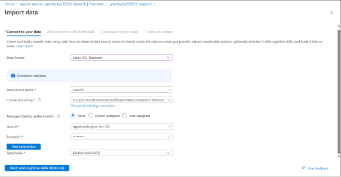
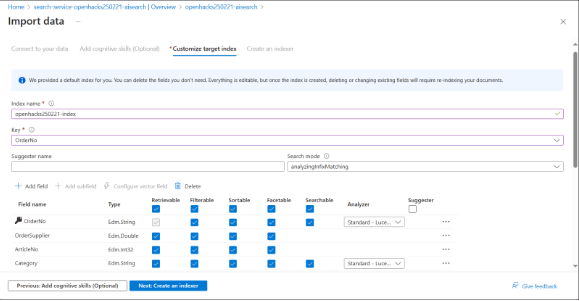
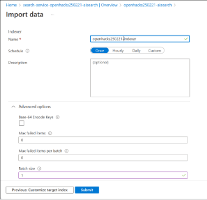
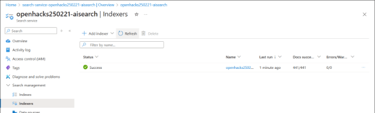
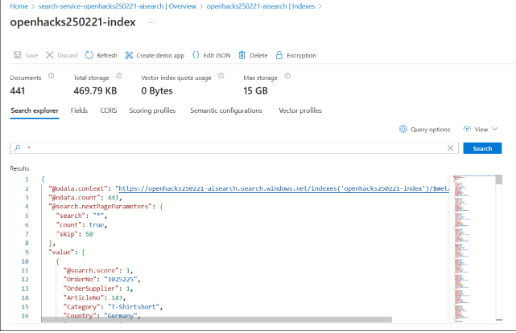
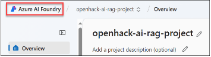
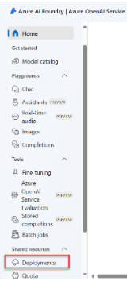
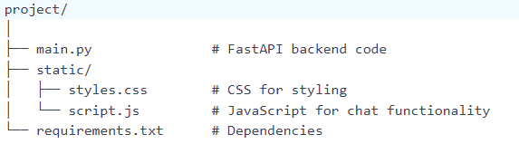
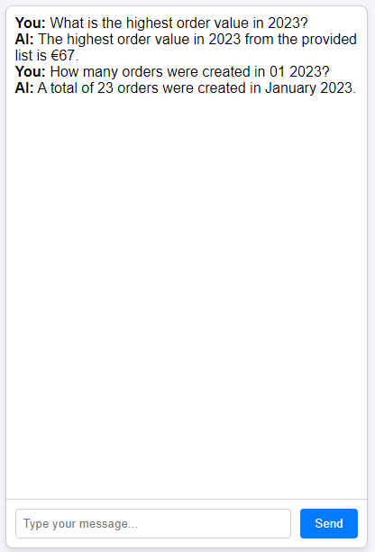

# Challenge 6 - Add AI Application to app

### Estimated Duration: 60 Minutes

## Create a view
1. To prepare the data set to be imported into Azure AI Search, from the Azure portal, connect to the Azure SQL database and use Query Editor to create a view of order items created in the year 2023 by running the following T-SQL script: 

    ```
    CREATE VIEW dbo.OrderDetails2023 AS 
    WITH RankedData AS ( 
        SELECT  
            o._KEY_OrderNo AS OrderNo,               -- Renamed _KEY_OrderNo to OrderNo 
            o._KEY_Supplier AS OrderSupplier,        -- Renamed _KEY_Supplier to OrderSupplier 
            o.ArticleNo,  
            a.A_Category AS Category,  
            s.S_Country AS Country,  
            c.KEY_CustomerNo,  
            c.C_MeansOfPayment,  
            c.C_Fit,  
            CAST(o.F_IsDefect AS VARCHAR(255)) AS IsDefect,  -- Changed F_IsDefect to string 
            CAST(o.F_IsReturned AS VARCHAR(255)) AS IsReturned, -- Changed F_IsReturned to string 
            o.F_Discounts,  
            o.F_VolumeDiscount,  
            o.F_StudentDiscount,  
            o.F_ListPrice,  
            c.C_City,  
            -- Convert _KEY_Date to a proper DateTime format (it's in 'DD.MM.YYYY' format) 
            -- using 104 to handle European date format (DD.MM.YYYY) 
            CONVERT(datetime, o._KEY_Date, 104) AS OrderDate,  
            ROW_NUMBER() OVER (ORDER BY o.ArticleNo DESC) AS row_num 
        FROM dbo.Article AS a 
        INNER JOIN dbo.Orders AS o ON a.ArticleNo = o.ArticleNo 
        INNER JOIN dbo.Customer AS c ON o.CustomerNumber = c.CustomerNumber 
        INNER JOIN dbo.Supplier AS s ON o.SupplierNumber = s.SupplierNo 
        WHERE YEAR(CONVERT(date, o._KEY_Date, 104)) = 2023  -- Filtering for 2023 
    ) 
    SELECT  
        * 
    FROM  
    RankedData; 
    ```
    All column names starting with the underscore character need to be renamed to include them in an Azure AI Search index. This will apply to _KEY_OrderNo, _KEY_Supplier, and _KEY_Date. 
    
    In addition, to make fields searchable, the data type of F_IsDefect, F_IsReturned should be changed to string. This change can also be applied when importing data into Azure AI Search. 

1. Run the following T-SQL query from Query Editor to validate that the count of order items presented by the view is 441.
    
    ```
    SELECT count(1) 
    FROM [dbo].[OrderDetails2023] 
    ```

## Create an Azure AI Search resource  

1. From the Azure portal, create an Azure AI Search service with the following settings: 

   * Location: preferably the same or close to the region hosting the Azure SQL database
   * Pricing tier: Basic with 1 partition (this seems to be entirely sufficient considering the size of the data set)


   > Note: Provisioning should take less than 1 minute. 

1. Record the value of Url (Oveview) and the primary admin key of the resource (Settings -> Keys) 

## Create an Azure AI Search index based on the SQL database view 

1. From the newly provisioned Azure AI Search service resource, run Import data wizard 

   
    
1. On the Connect to your data page, point to the view created in the previous task: 

   
    
1. Do not modify settings on the Add cognitive skills (Optional) page 

1. On the Customize target index page, assign a descriptive name to the index, set Key to OrderNo and set all fields to Retrievable, Filterable, Sortable, Facetable, and Searchable, except for C_Fit, F_Discounts, F_VolumeDiscount, and F_StudentDiscount, for which you can disable Filterable, Sortable, and Facetable. In real-life scenarios you'd be more selective, but given the data set size, this is not particularly relevant.  

   
    
1. On the Import data page, assign a descriptive name to the indexer, set Schedule to Once, and, in the Advanced options section, set Batch size to 1 (this is important because otherwise the import will fail). 

   
    
1. Once you select Submit, index creation should take about 1 minute. To track progress, select the Indexer item in the vertical navigation menu in the Search management section. 

   
    
1. To validate the presence of the inventory data, in the Search management section of the vertical navigation menu, select Indexes, select the newly created index, on the Search explorer tab, in the Search text box, enter * and then select Search. Ensure that the listing of documents matches data in SalesDB. 

   
    
## Create an Azure OpenAI Services model deployment 

1. Browse to https://ai.azure.com and, in the upper left corner of the resulting page, select Azure AI Foundry and login. 

   
    
1. On the Azure AI Foundry landing page, in the Focused on Azure OpenAI Services, select Let's go. 

1. On the Azure AI Foundry | Azure OpenAI Service page, in the vertical navigation menu on the left side, in the Shared resources section, select Deployments. 

   
    
1. Create a deployment of the gpt-4o model with the following settings:
   
   * Name: gpt-4o
   * Deployment type: Global Standard
   * Tokens per Minute Rate Limit: 100K (consider increasing this value if running into 429 errors)
     
1. Record the values of Target URI and Key of the newly created deployment. 

## Implement an API for natural language queries of the Azure AI Search index 

1. Install VS Code and Python 3.10.x (if needed) 

1. Install the Python and Python Environment Manager VSCode extensions  

1. Set up a Python virtual environment 

   * Start VS Code and open the Command Prompt-based terminal pane
   * Create a new folder for the project

     ```
     mkdir azure-ai-search-api 
    
     cd azure-ai-search-api 
     ```
        
   * Initialize a virtual environment 

     ```
     python -m venv venv 
     ```
        
   * Activate the virtual environment  

     ```
     venv\Scripts\activate 
     ```
        
   * Install required Python packages 
        
     * **fastapi** Web framework for building APIs.
     * **uvicorn** ASGI server to run FastAPI apps.
     * **azure-search-documents** Azure AI Search client library.

       ```
       pip install fastapi uvicorn azure-search-documents 
       ```
1. Setup a folder structure like the following:

   
    
1. Create the Python API
   
   * In VSCode, create a file named main.py
   * Add the following code to main.py (make sure to replace the <placeholder> values with those you recorded earlier in this challenge):
     ```
     from fastapi import FastAPI, Request
     from fastapi.responses import HTMLResponse
     from fastapi.staticfiles import StaticFiles
     from azure.core.credentials import AzureKeyCredential
     from azure.search.documents import SearchClient
     from azure.search.documents.indexes import SearchIndexClient
     from openai import AzureOpenAI
    
     app = FastAPI()
    
     # Azure AI Search Configuration
     SEARCH_SERVICE_ENDPOINT = "https://mysearchv111.search.windows.net"
     SEARCH_INDEX_NAME = "azuresql-index"
     SEARCH_API_KEY = "Shd7goh1B2dXyBeU0LP1952Ev2onrLJohkyTrxTAxEAzSeAsuN3S"
    
     # Azure OpenAI Configuration
     AZURE_OPENAI_ENDPOINT = "https://ai-bnielsen2132ai828320706413.openai.azure.com"
     AZURE_OPENAI_KEY = "03xISqy5lrH5WCm2DxIp5BXBWViuVVyg8IplXnds7sPrFiu2Lc4sJQQJ99BBACHYHv6XJ3w3AAAAACOG5HX2"
     AZURE_OPENAI_DEPLOYMENT = "gpt-4o"  # Model deployment name in Azure OpenAI (gpt-4o)
    
    
     # Initialize Azure AI Search clients
     search_client = SearchClient(
         SEARCH_SERVICE_ENDPOINT, SEARCH_INDEX_NAME, AzureKeyCredential(SEARCH_API_KEY)
     )
     index_client = SearchIndexClient(
         SEARCH_SERVICE_ENDPOINT, AzureKeyCredential(SEARCH_API_KEY)
     )
    
     # Initialize Azure OpenAI client
     openai_client = AzureOpenAI(
         azure_endpoint=AZURE_OPENAI_ENDPOINT,
         api_key=AZURE_OPENAI_KEY,
         api_version="2023-09-01-preview",
     )
    
    
     # Retrieve the index schema to describe it to the Azure OpenAI model
     def get_index_schema():
         """Fetches and describes the Azure AI Search index schema."""
         index = index_client.get_index(SEARCH_INDEX_NAME)
         field_descriptions = {}
         for field in index.fields:
             field_name = field.name
             field_type = field.type
             if field_type == "Edm.String":
                 description = f"{field_name} is a text field."
             elif field_type == "Edm.Int32":
                 description = f"{field_name} is an integer field."
             elif field_type == "Edm.Double":
                 description = f"{field_name} is a floating-point number field."
             elif field_type == "Edm.DateTimeOffset":
                 description = f"{field_name} is a date field in ISO 8601 format."
             else:
                 description = f"{field_name} is a {field_type} field."
             field_descriptions[field_name] = description
         return field_descriptions
    
    
     # Convert a natural language query to Lucene syntax to be used by an index search
     def generate_lucene_query(user_query):
         """Uses GPT-4o to convert a natural language query into Lucene based on the index schema."""
         index_schema = get_index_schema()
         schema_description = "\n".join([f"- {desc}" for desc in index_schema.values()])
         prompt = (
             "Convert the following natural language query into a Lucene search query for Azure AI Search.\n"
             "Use the following index fields and their types:\n"
             f"{schema_description}\n\n"
             f"User query: '{user_query}'\n"
             "Lucene query:"
         )
         response = openai_client.chat.completions.create(
             model=AZURE_OPENAI_DEPLOYMENT,
             messages=[
                 {
                     "role": "system",
                     "content": "You are an AI that converts user queries into precise Lucene queries for Azure AI Search.",
                 },
                 {"role": "user", "content": prompt},
             ],
             max_tokens=100,
         )
         try:
             lucene_query = response.choices[0].message.content.strip()
             lucene_query = lucene_query.split("\n")[
                 -1
             ].strip()  # Extract the final line which should be the query
             lucene_query = lucene_query.replace("```", "").replace(
                 "\n", ""
             )  # Clean newline and backticks
         except AttributeError as e:
             print(f"Error accessing response content: {e}")
             lucene_query = ""
         # Additional cleaning logic
         lucene_query = " ".join(
             [word for word in lucene_query.split() if "_exists_" not in word]
         )
         lucene_query = (
             lucene_query.replace("OrderDate:[", "OrderDate ge ")
             .replace("TO", " and OrderDate le ")
             .replace("]", "")
         )
         if "sortby" in lucene_query:
             lucene_query = lucene_query.split("sortby")[
                 0
             ].strip()  # Remove any sortby from filter
         if "ORDER BY" in lucene_query:
             lucene_query = (
                 lucene_query.replace("ORDER BY", "$orderby=")
                 .replace("LIMIT 1", "$top=1")
                 .strip()
             )
         return lucene_query
    
    
     # Generate an Azure OpenAI model response based on the Lucene query search results
     def get_llm_response(context, user_query):
         """Generates a concise AI response based on the search results."""
         response = openai_client.chat.completions.create(
             model=AZURE_OPENAI_DEPLOYMENT,
             messages=[
                 {
                     "role": "system",
                     "content": "You are an AI assistant that provides concise answers to user queries based on the provided search data.",
                 },
                 {
                     "role": "user",
                     "content": f"Given this data: {context}, answer the question: '{user_query}' in one sentence.",
                 },
             ],
             max_tokens=100,
         )
         return response.choices[0].message.content.strip().split(".")[0] + "."
    
    
     # Serve static files (CSS, JS)
     app.mount("/static", StaticFiles(directory="static"), name="static")
    
    
     # Chat Interface (Embeddable Page)
     @app.get("/chat", response_class=HTMLResponse)
     async def chat_interface():
         return """
     <!DOCTYPE html>
     <html lang="en">
     <head>
         <meta charset="UTF-8">
         <meta name="viewport" content="width=device-width, initial-scale=1.0">
         <meta http-equiv="Content-Security-Policy" content="script-src 'self' 'unsafe-eval';">
         <title>Azure OpenAI Chat</title>
         <link rel="stylesheet" href="/static/styles.css">
     </head>
     <body>
         <div class="chat-container">
             <div id="chat-box" class="chat-box"></div>
             <div class="input-container">
                 <input type="text" id="user-input" placeholder="Type your message..." />
                 <button id="send-button">Send</button>
             </div>
         </div>
         <script src="/static/script.js"></script>
     </body>
     </html>
         """
    
    
     # API Endpoint for Chat
     @app.post("/chat-api")
     async def chat(request: Request):
         data = await request.json()
         user_query = data.get("message", "")
    
         try:
             # Step 1: Convert the user query to a Lucene query
             lucene_query = generate_lucene_query(user_query)
     
             # Step 2: Execute the search in Azure AI Search
             results = search_client.search(search_text="*", filter=lucene_query)
             items = [dict(result) for result in results]
    
             # Step 3: Generate an AI-enhanced response
             llm_response = get_llm_response(items, user_query)
    
             return {
                 "query": user_query,
                 "lucene_query": lucene_query,
                 "results": items,
                 "ai_response": llm_response,
             }
    
         except Exception as e:
             return {"error": str(e)}

     ```
    
1. Here is the code for the script.js file

    ```
    document.addEventListener("DOMContentLoaded", () => {
        const sendButton = document.getElementById("send-button");
        const userInput = document.getElementById("user-input");
        const chatBox = document.getElementById("chat-box");
    
        sendButton.addEventListener("click", sendMessage);
    
        function sendMessage() {
            const userMessage = userInput.value.trim();
            if (!userMessage) return;
    
            // Display user message
            chatBox.innerHTML += `<div><strong>You:</strong> ${userMessage}</div>`;
    
            // Clear input field
            userInput.value = "";
    
            // Send message to backend
            fetch("/chat-api", {
                method: "POST",
                headers: { "Content-Type": "application/json" },
                body: JSON.stringify({ message: userMessage })
            })
                .then(response => response.json())
                .then(data => {
                    const aiResponse = data.ai_response || "Sorry, I couldn't process that.";
                    chatBox.innerHTML += `<div><strong>AI:</strong> ${aiResponse}</div>`;
                    chatBox.scrollTop = chatBox.scrollHeight; // Scroll to bottom
                })
                .catch(error => {
                    console.error("Error:", error);
                    chatBox.innerHTML += `<div><strong>Error:</strong> Failed to get a response.</div>`;
                });
        }
    });
    ```

1. Here is the script for the styles.css file

    ```
    body {
        font-family: Arial, sans-serif;
        margin: 0;
        padding: 0;
        display: flex;
        justify-content: center;
        align-items: center;
        height: 100vh;
        background-color: #f4f4f9;
    }
    
    .chat-container {
        width: 400px;
        height: 600px;
        border: 1px solid #ccc;
        border-radius: 8px;
        background-color: #fff;
        box-shadow: 0 4px 6px rgba(0, 0, 0, 0.1);
        display: flex;
        flex-direction: column;
    }
    
    .chat-box {
        flex: 1;
        overflow-y: auto;
        padding: 10px;
        border-bottom: 1px solid #ccc;
    }
    
    .input-container {
        display: flex;
        padding: 10px;
        gap: 10px;
    }
    
    #user-input {
        flex: 1;
        padding: 8px;
        border: 1px solid #ccc;
        border-radius: 4px;
    }
    
    button {
        padding: 8px 16px;
        background-color: #007bff;
        color: white;
        border: none;
        border-radius: 4px;
        cursor: pointer;
    }
    
    button:hover {
        background-color: #0056b3;
    }
    ```

1. Run the API - From the Command Prompt-based terminal pane in VS Code, run
   
    ```
    uvicorn app:app --reload 
    ```
    * This will launch FastAPI and make it available via http://127.0.0.1:8000
    * To validate, open a web browser window and browse to http://127.0.0.1:8000/chat
    
    

1. Test the chat window with the following prompts

   > Note: Please only run one at a time

   ```
   What is the highest order value in 2023?
   How many orders were created in 01 2023?
   How many sweaters were sold in January 2023? 
   How many items in each category were sold in January 2023?
   How many items in each category were sold in the first quarter of 2023?
   ```

1. Results will resemble the following:

    

## Conclusion

In this challenge, you created a view using SQL scripts, created an Azure AI search service, created an Azure AI search index on the SQL database view, deployed Azure OpenAI models and implemented an API for natural language queries of the Azure AI Search index to get the app running locally.
