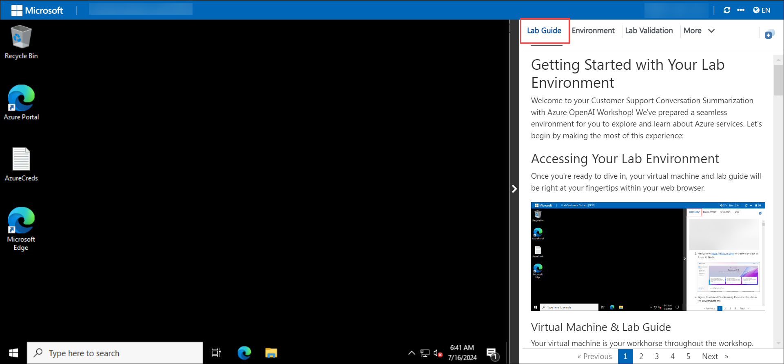
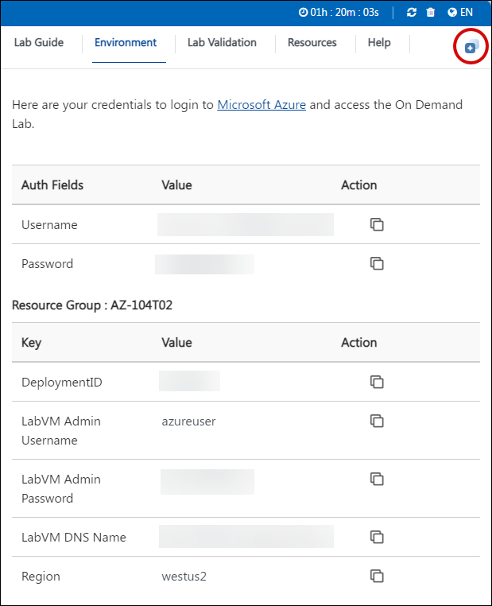
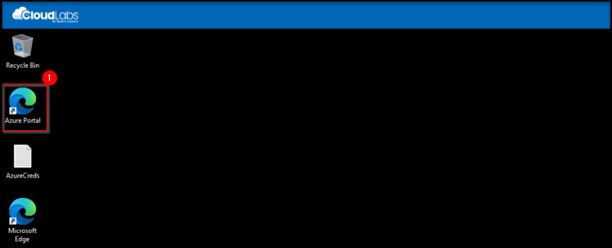

# Mircosoft Azure OpenHack - Hackathon

## Introduction

This hackathon is designed to immerse you in the world of Azure cloud services, machine learning, AI, and data management. Throughout the hackathon, you will tackle real-world challenges faced by Woodgrove Retail, a hypothetical company, by utilizing a wide array of Azure tools and technologies. The challenges span across SQL Server management, machine learning model development, AI-powered image search, document processing using the RAG pattern, and advanced data retrieval techniques.

By participating, you’ll gain practical experience in building AI-driven solutions, deploying machine learning models, enhancing customer interaction, and improving operational efficiency. Whether you're working with Azure's data services or integrating cutting-edge AI capabilities, this hackathon offers an excellent opportunity to refine your skills and contribute to innovative business solutions.

## Learning Objectives

By participating in this hackathon, you will:

- Learn to use Azure data services like SQL Server and Azure Machine Learning to restore and analyze data. You will also create
- Integrate Azure Vision Studio and Machine Learning to build AI models for image recognition. Learn how to develop applications that allow users to search for products based on images.
- Build and transform data pipelines in Azure Machine Learning, train machine learning models, and deploy them to detect data issues, enhancing data-driven business solutions.
- Learn to apply the Retrieval-Augmented Generation (RAG) pattern to generate and process documents, and use Azure Cognitive Services to extract structured data from unstructured formats like PDFs.
- Develop advanced search capabilities using the RAG pattern and create Node.js applications that enhance data retrieval and improve systems like inventory management.

## Hackathon Format: Challenge Based

This hackathon adopts a challenge-based format, offering you a unique opportunity to learn while dealing with practical problems. Each challenge includes one or more self-contained tasks designed to test and enhance your skills in specific aspects of Azure OpenAI services. You will approach these challenges by:

- Analyzing the problem statement.
- Strategizing your approach to find the most effective solution.
- Leveraging the provided lab environment and Azure AI services.
- Collaborating with peers to refine and implement your solutions.

## Challenges Overview

- **Challenge 1 - Restore a SQL Server Backup and Query the Data:** Participants need to restore a SQL Server backup and query the data using SQL Server Management Studio in Azure. The objective is to analyze the data through views or custom queries to uncover insights and solve business challenges facing the company.

- **Challenge 2 - Use Machine Learning to Expose Data Issues:** This challenge requires participants to set up an Azure Machine Learning compute environment, create datasets, and build a pipeline to transform the data. After running the pipeline, participants will train a machine learning model, deploy it as a service, and test it to detect data issues.

- **Challenge 3 - Search Based on Images:** The goal is to create an AI service using Azure Vision Studio and Azure Machine Learning to allow customers to upload images and find similar products in the database. This challenge focuses on image tagging and model creation to match uploaded images with available products.

- **Challenge 4 - RAG Pattern:** Participants will use the Retrieval-Augmented Generation (RAG) pattern to process data from SQL Server and images. They will generate PDFs from this data and upload them to Azure Blob Storage. Using Azure Cognitive Services, they will extract and enhance data from the PDFs, including article numbers, categories, and related images.

- **Challenge 5 - Advanced Retrieval-Augmented Generation (RAG) Pattern:** In this challenge, participants will export data from SQL Server to a CSV file and build an inventory application using Node.js. The focus is on implementing an advanced RAG pattern to enhance data retrieval and search capabilities in the application, improving overall inventory management.

## Getting started with the Hackathon

Welcome to your Mircosoft Azure OpenHack - Hackathon! We've prepared a seamless environment for you to explore and learn about Azure services. Let's begin by making the most of this experience:
 
## Accessing Your Lab Environment
 
Once you're ready to dive in, your virtual machine and lab guide will be right at your fingertips within your web browser.

  

### Virtual Machine & Lab Guide
 
Your virtual machine is your workhorse throughout the workshop. The lab guide is your roadmap to success.
 
## Exploring Your Lab Resources
 
To get a better understanding of your lab resources and credentials, navigate to the **Environment** tab.
 

 
## Utilizing the Split Window Feature
 
For convenience, you can open the lab guide in a separate window by selecting the **Split Window** button from the Top right corner.
 

 
## Managing Your Virtual Machine
 
Feel free to start, stop, or restart your virtual machine as needed from the **Resources** tab. Your experience is in your hands!

## Let's Get Started with Azure Portal
 
1. On your virtual machine, click on the **Azure Portal** icon as shown below:
 
   

1. On the **Sign in to Microsoft Azure** tab you will see the login screen, in that enter the following email/username, and click on **Next**. 

   * **Email/Username**: <inject key="AzureAdUserEmail"></inject>
   
     
     
1. Now enter the following password and click on **Sign in**.
   
   * **Password**: <inject key="AzureAdUserPassword"></inject>
   
     

1. If you see the pop-up Action Required, click **Ask Later**.

   

   >**NOTE:** Do not enable MFA, select **Ask Later**.
     
1. If you see the pop-up **Stay Signed in?**, select **No**.

1. If you see the pop-up **You have free Azure Advisor recommendations!**, close the window to continue the lab.

1. If a **Welcome to Microsoft Azure** popup window appears, select **Maybe Later** to skip the tour.
   
## Support Contact
 
The CloudLabs support team is available 24/7, 365 days a year, via email and live chat to ensure seamless assistance at any time. We offer dedicated support channels tailored specifically for both learners and instructors, ensuring that all your needs are promptly and efficiently addressed.

Learner Support Contacts:
- Email Support: cloudlabs-support@spektrasystems.com
- Live Chat Support: https://cloudlabs.ai/labs-support

Now, click on **Next** from the lower right corner to move on to the next page.

### Happy Learning!!
